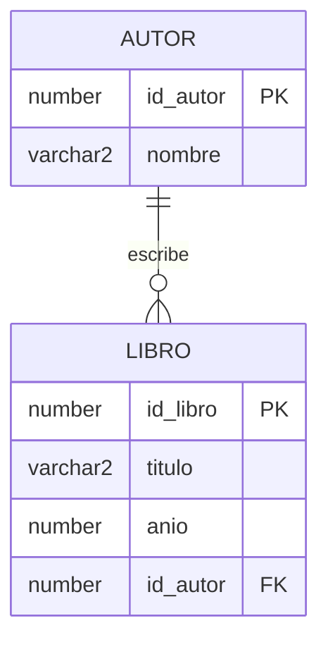

> Esta lectura acompaña al **Video 1** de la Unidad 1. Aquí tienes el mismo contenido para repasar a tu ritmo, con el SQL listo para copiar.

## Las cuatro familias de SQL

Antes de hablar de DDL conviene ubicarlo. Todo comando de SQL pertenece a una de estas cuatro familias, según lo que hace:

| Familia | Significa | Comandos típicos | ¿Qué toca? |
|---|---|---|---|
| **DDL** | *Data Definition Language* | `CREATE`, `ALTER`, `DROP`, `TRUNCATE` | La **estructura** (tablas, columnas, reglas) |
| **DML** | *Data Manipulation Language* | `INSERT`, `UPDATE`, `DELETE` | Los **datos** (las filas) |
| **DQL** | *Data Query Language* | `SELECT` | La **consulta** (leer datos) |
| **DCL** | *Data Control Language* | `GRANT`, `REVOKE` | Los **permisos** (quién puede qué) |

La idea clave: **DDL no mueve datos, define el molde donde viven los datos.**

## ¿Qué es DDL?

El **DDL** es el lenguaje con el que diseñamos y modificamos la *estructura* de la base de datos. Cuando usas DDL no estás cargando información: estás decidiendo **qué forma** tendrá esa información y **qué reglas** debe cumplir.

Tres verbos resumen casi todo:

- `CREATE` — crear una tabla (u otro objeto).
- `ALTER` — modificar algo que ya existe.
- `DROP` — eliminar el objeto por completo.

## CREATE: definir con reglas de negocio

Crear una tabla no es solo listar columnas: es **codificar las reglas del negocio** para que la base de datos las haga cumplir sola.

```sql
CREATE TABLE autor (
  id_autor NUMBER PRIMARY KEY,
  nombre   VARCHAR2(100) NOT NULL
);

CREATE TABLE libro (
  id_libro NUMBER PRIMARY KEY,
  titulo   VARCHAR2(150) NOT NULL,
  anio     NUMBER CHECK (anio > 1450),
  id_autor NUMBER REFERENCES autor(id_autor)
);
```

Cada restricción tiene un *para qué*:

- `PRIMARY KEY` → identifica de forma única a cada fila.
- `NOT NULL` → ese dato es obligatorio (un libro sin título no sirve).
- `CHECK (anio > 1450)` → impide valores imposibles (no hay libros impresos antes de la imprenta).
- `REFERENCES autor(id_autor)` → un libro **debe** apuntar a un autor que exista (integridad referencial).

Ese diseño se ve así:



## ALTER: evolucionar sin empezar de cero

Los negocios cambian y las tablas también. `ALTER` modifica la estructura **sin perder** los datos que ya tienes.

```sql
-- Agregar una columna nueva a una tabla existente
ALTER TABLE libro ADD genero VARCHAR2(50);
```

Esto sigue siendo DDL: cambia la *estructura* (aparece una columna), no inserta ni modifica filas.

## DROP: eliminar por completo

`DROP` borra el objeto entero —la tabla y todo su contenido— de la base de datos.

```sql
DROP TABLE libro;
```

Cuidado con la diferencia que más confunde:

- `DELETE FROM libro;` → **DML**: borra *filas*, la tabla sigue existiendo (vacía).
- `DROP TABLE libro;` → **DDL**: borra la *tabla completa*, deja de existir.

## En una frase

DDL es el lenguaje de la **estructura**. Diseñas el molde (`CREATE`), lo adaptas cuando el negocio cambia (`ALTER`) y lo retiras cuando ya no aporta (`DROP`). En el [Tema 2](/posts/tema-2-ddl-en-la-practica/) lo llevamos a un caso real: una cadena de cines en Oracle.
