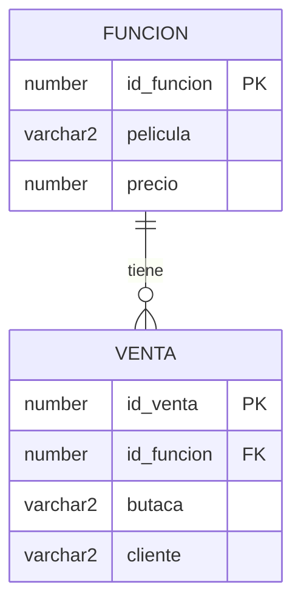

> Esta lectura acompaña al **Video 2** del Sprint 1. Reproduce el mismo ejercicio que puedes correr en [Oracle Live SQL](https://livesql.oracle.com).

Vamos a diseñar la base de una **cadena de cines**. Solo dos tablas, pero con las reglas que protegen al negocio: `funcion` (cada película en cartelera) y `venta` (cada butaca vendida).

## 1) CREATE con reglas de negocio

```sql
-- Tabla 1 · funcion
CREATE TABLE funcion (
  id_funcion NUMBER GENERATED BY DEFAULT AS IDENTITY PRIMARY KEY,
  pelicula   VARCHAR2(100) NOT NULL,
  precio     NUMBER(6,2)   NOT NULL,
  CONSTRAINT chk_precio CHECK (precio > 0)      -- nunca una funcion gratis por error
);

-- Tabla 2 · venta
CREATE TABLE venta (
  id_venta   NUMBER GENERATED BY DEFAULT AS IDENTITY PRIMARY KEY,
  id_funcion NUMBER        NOT NULL,
  butaca     VARCHAR2(5)   NOT NULL,
  cliente    VARCHAR2(100) NOT NULL,
  CONSTRAINT fk_venta_funcion FOREIGN KEY (id_funcion) REFERENCES funcion(id_funcion),
  CONSTRAINT uq_butaca        UNIQUE (id_funcion, butaca)   -- 1 butaca = 1 venta por funcion
);
```

> **Nota Oracle:** `GENERATED BY DEFAULT AS IDENTITY` (autonumérico) requiere **Oracle 12c o superior**. En Oracle Live SQL funciona sin problema; en versiones antiguas (11g) se reemplaza por una `SEQUENCE` + `TRIGGER`.

Las reglas que acabamos de codificar:

- `CHECK (precio > 0)` → ninguna función puede quedar con precio cero por un error de carga.
- `FOREIGN KEY ... REFERENCES funcion` → no se puede vender una butaca para una función que no existe.
- `UNIQUE (id_funcion, butaca)` → la misma butaca **no** se puede vender dos veces en la misma función.



## 2) PROBAR que las reglas protegen al negocio

```sql
-- Creamos una funcion (Duna 2) -> tendra id_funcion = 1
INSERT INTO funcion (pelicula, precio) VALUES ('Duna 2', 25.00);

-- Vendemos la butaca F12 para esa funcion -> OK
INSERT INTO venta (id_funcion, butaca, cliente) VALUES (1, 'F12', 'Alvaro');

-- Intentamos vender OTRA VEZ la misma butaca F12 -> DEBE FALLAR
INSERT INTO venta (id_funcion, butaca, cliente) VALUES (1, 'F12', 'Otro cliente');
```

Oracle rechaza la segunda venta de la butaca:

```text
ORA-00001: unique constraint (UQ_BUTACA) violated
```

La restricción hizo su trabajo: la butaca quedó **blindada**. Nadie compró dos veces el mismo asiento.

## 3) ALTER: evolucionar sin apagar la operación

Llega el formato **4DX** y necesitamos registrar el formato de cada venta. Lo agregamos **en caliente**, sin perder ninguna venta existente:

```sql
ALTER TABLE venta ADD formato VARCHAR2(10) DEFAULT 'Normal';
```

Las ventas anteriores quedan con `formato = 'Normal'` y las nuevas pueden registrar `'4DX'`. Cero downtime, cero datos perdidos.

## 4) DROP con criterio

`DROP` es poderoso: borra la tabla completa. La regla profesional es **borrar solo lo temporal**.

```sql
-- Tabla temporal de prueba (copia columnas y tipos, NO las restricciones)
CREATE TABLE venta_tmp AS SELECT * FROM venta WHERE 1 = 0;

-- Ya cumplio su proposito: la eliminamos. Esta SI se borra.
DROP TABLE venta_tmp;

-- Y ahora? La tabla ya no existe:
SELECT * FROM venta_tmp;
```

```text
ORA-00942: table or view does not exist
```

Las tablas `venta` y `funcion` **no** se borran: se archivan, porque el negocio (y los impuestos) exigen conservar el histórico. `DROP` se reserva para lo que de verdad fue temporal.

> **Dos detalles clave de DDL en Oracle:** (1) `CREATE TABLE ... AS SELECT` copia columnas y tipos, pero **no** las restricciones (PK, FK, UNIQUE, CHECK). (2) Todo comando DDL hace **COMMIT implícito**: confirma de forma automática lo anterior y **no se puede deshacer con `ROLLBACK`**. Por eso el `ALTER` y los `CREATE` de arriba ya dejaron grabados los `INSERT` previos.

## La lección del sprint

DDL no es teoría: cada `CREATE`, `ALTER` o `DROP` es una decisión de negocio.

- Con `CREATE` + restricciones, la base **se protege sola**.
- Con `ALTER`, el sistema **evoluciona** sin detenerse.
- Con `DROP`, eliminas **solo lo que sobra**, con criterio.

¿Listo? Vuelve al [Sprint 1](/sprint-1/) y completa el **formulario post** para cerrar la unidad.
